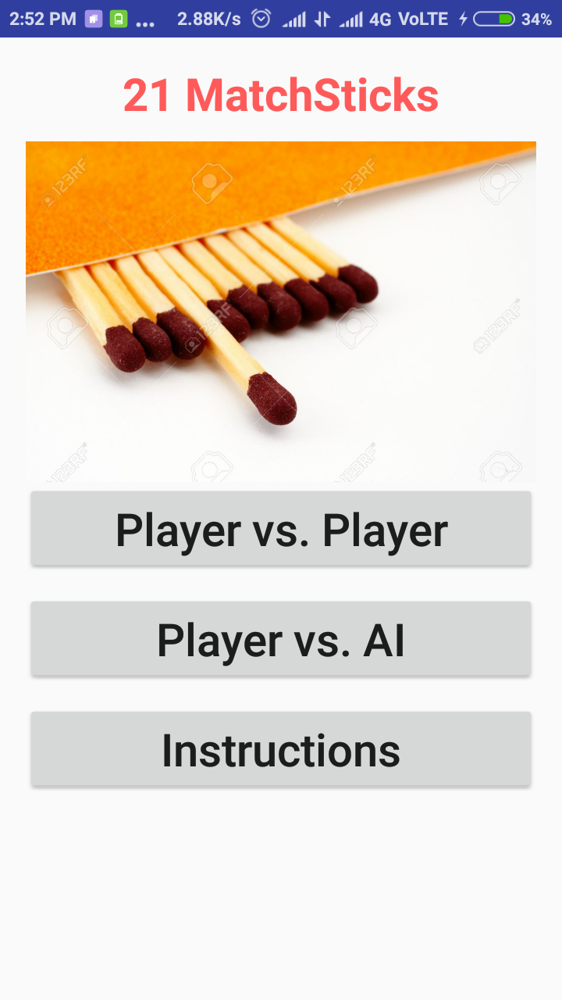
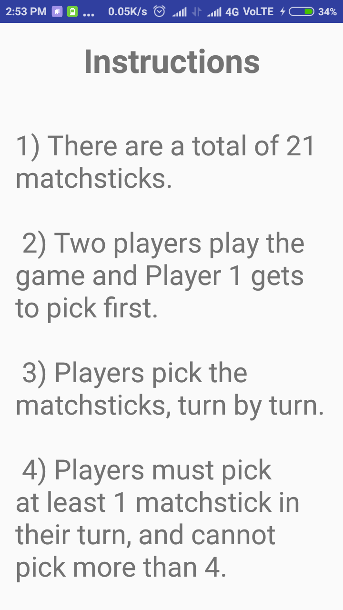
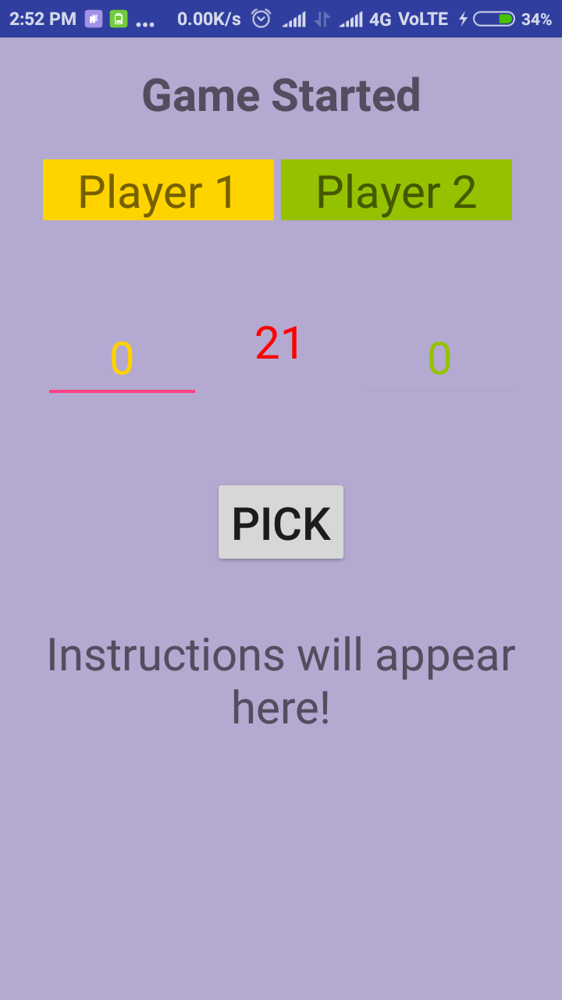

# 21 Matchsticks - The game you can't win ;)

This is my first - very own - android app.
Try to beat its AI without reading the code.:sunglasses: 
It was built at the end of my second semester, in 2016.

## Screenshots

<table>
  <tr>
    <td></td>
    <td></td>
    <td></td>
  </tr>
</table>

## Play, learn and contribute:
This is a very beginner friendly project. Feel free to build your own app using this, or build upon this one. 
**Want to learn to contribute to open source?** Start with this small project! Consider this [course](https://in.udacity.com/course/how-to-use-git-and-github--ud775) if you are new to Git and Github. 

If you are interested in contributing to this project, do the following:
1. **Fork** the repo on GitHub
2. **Clone** the project to your own machine
3. **Open an issue** in this repository
4. **Commit** changes to your own branch
4. **Push** your work back up to your fork
5. **Submit a Pull request** so that I can review and merge your changes

## Acknowledgement
This app is inspired by a problem statement in [Let Us C](https://www.flipkart.com/search?q=let+us+c), by [Yashwant Kanetkar](https://en.wikipedia.org/wiki/Yashavant_Kanetkar).